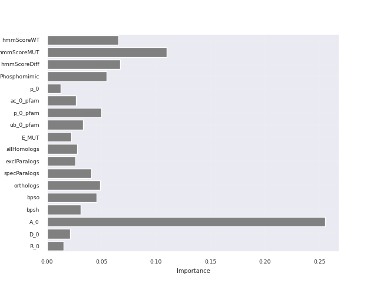

 

Activark is a predictor of activating, deactivating and resistance mutations in kinases
Access the Flask webApp [here](http://activark.russelllab.org)

---

## How to run Activark?

Move to the directory (mandatory)
> cd ML/

See the help section
> ./prepareTestData.py -h

Example:
> ./prepareTestData.py sample_mutations.txt

---

## Performance

10-fold stratified CV for the AD predictor

10-fold stratified CV on shuffled dataset

---

## Feature importance

---

## Best Decision tree

---

## Database

Activark uses the following DB schema:
